# Sign Language to Text Conversion


[YouTube](https://www.youtube.com/watch?v=Rd04XB6F0pU)
## Abstract

Sign language is one of the oldest and most natural form of language for communication, but since most people do not know sign language and interpreters are very difficult to come by we have come up with a real time method using neural networks for fingerspelling based american sign language.
 
In this method, the hand is first passed through a filter and after the filter is applied the hand is passed through a classifier which predicts the class of the hand gestures. This method provides 98.00 % accuracy for the 26 letters of the alphabet.

## Project Description

American sign language is a predominant sign language Since the only disability D&M people have is communication related and they cannot use spoken languages hence the only way for them to communicate is through sign language. 

Communication is the process of exchange of thoughts and messages in various ways such as speech, signals, behavior and visuals. 

Deaf and Mute(Dumb)(D&M) people make use of their hands to express different gestures to express their ideas with other people. 

Gestures are the nonverbally exchanged messages and these gestures are understood with vision. This nonverbal communication of deaf and dumb people is called sign language. 

Sign language is a visual language and consists of 3 major components 

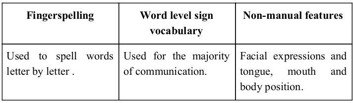

In this project I basically focus on producing a model which can recognize Fingerspelling based hand gestures in order to form a complete word by combining each gesture. 

The gestures I  trained are as given in the image below.

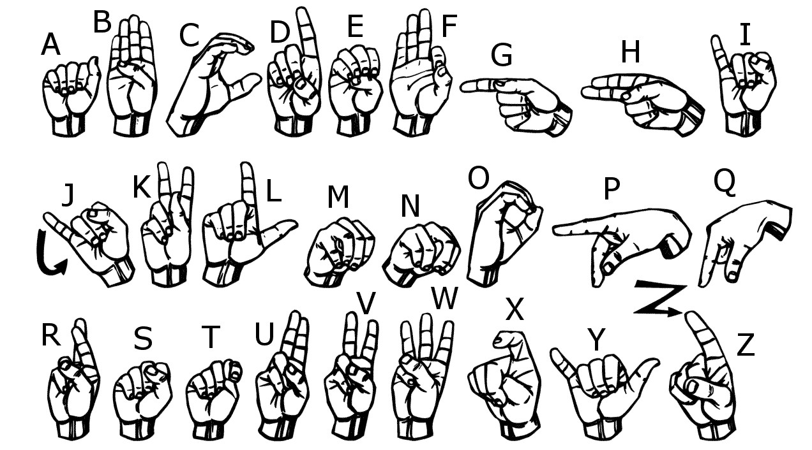

# Steps of building this project

### 1. The first Step of building this project was of creating the folders for storing the training and testing data. As, in this project I have built my own dataset.

``` python
# Importing the Libraries Required

import os
import string

# Creating the directory Structure

if not os.path.exists("dataSet"):
    os.makedirs("dataSet")

if not os.path.exists("dataSet/trainingData"):
    os.makedirs("dataSet/trainingData")

if not os.path.exists("dataSet/testingData"):
    os.makedirs("dataSet/testingData")

# Making folder  0 (i.e blank) in the training and testing data folders respectively
for i in range(0):
    if not os.path.exists("dataSet/trainingData/" + str(i)):
        os.makedirs("dataSet/trainingData/" + str(i))

    if not os.path.exists("dataSet/testingData/" + str(i)):
        os.makedirs("dataSet/testingData/" + str(i))

# Making Folders from A to Z in the training and testing data folders respectively

for i in string.ascii_uppercase:
    if not os.path.exists("dataSet/trainingData/" + i):
        os.makedirs("dataSet/trainingData/" + i)
    
    if not os.path.exists("dataSet/testingData/" + i):
        os.makedirs("dataSet/testingData/" + i)
```

### 2. The second step, after the folder creation is of creating the training and testing dataset.

I captured each frame shown by the webcam of our machine. 

In each frame I defined a region of interest (ROI) which is denoted by a blue bounded square as shown in the image below.

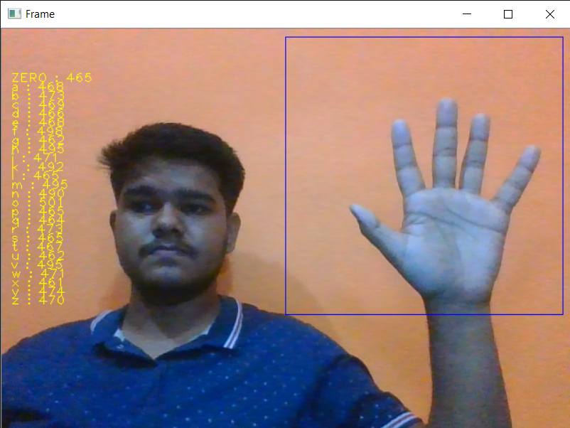

After capturing the image from the ROI, I applied gaussian blur filter to the image which helps for extracting various features of the image. 

The image after applying gaussian blur looks like below.

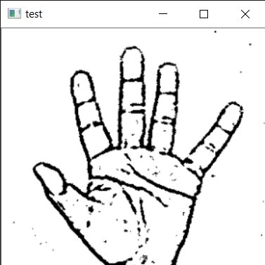

### The code for image proceesing is as following :

```python
import numpy as np
import cv2
minValue = 70
def func(path):    
    frame = cv2.imread(path)
    
    gray = cv2.cvtColor(frame, cv2.COLOR_BGR2GRAY)
    blur = cv2.GaussianBlur(gray,(5,5),2)

    th3 = cv2.adaptiveThreshold(blur,255,cv2.ADAPTIVE_THRESH_GAUSSIAN_C,cv2.THRESH_BINARY_INV,11,2)
    ret, res = cv2.threshold(th3, minValue, 255, cv2.THRESH_BINARY_INV+cv2.THRESH_OTSU)
    return res
```

### 3. After the creation of the training and testing data. The third step is of creating a model for training. Here, I have used Convolutional Neural Network(CNN) for building this model. The model summary is as following 

#### Convolutional Neural Network(CNN)
Unlike regular Neural Networks, in the layers of CNN, the neurons are arranged in 3 dimensions: width, height, depth.       

The neurons in a layer will only be connected to a small region of the layer (window size) before it, instead of all of the neurons in a fully-connected manner.       

Moreover, the final output layer would have dimensions(number of classes), because by the end of the CNN architecture we will reduce the full image into a single vector of class scores.


##### 1. Convolutional Layer:  
In convolution layer I  have taken a small window size [typically of length 5*5] that extends to the depth of the input matrix. 

The layer consists of learnable filters of window size. During every iteration I slid the window by stride size [typically 1], and compute the dot product of filter entries and input values at a given position. 

As I continue this process well create a 2-Dimensional activation matrix that gives the response of that matrix at every spatial position. 

That is, the network will learn filters that activate when they see some type of visual feature such as an edge of some orientation or a blotch of some colour. 

##### 2. Pooling Layer: 
We use pooling layer to decrease the size of activation matrix and ultimately reduce the learnable parameters. 

There are two types of pooling:

##### a. Max Pooling: 
In max pooling we take a window size [for example window of size 2*2], and only taken the maximum of 4 values. 

Well lid this window and continue this process, so well finally get an activation matrix half of its original Size.

##### b. Average Pooling: 
In average pooling we take average of all Values in a window.

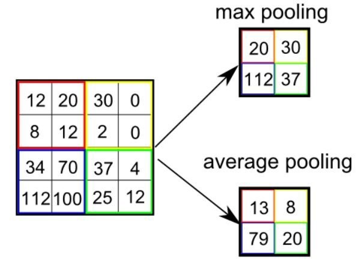

##### 3. Fully Connected Layer:
In convolution layer neurons are connected only to a local region, while in a fully connected region, well connect the all the inputs to neurons.

<p align="center">
  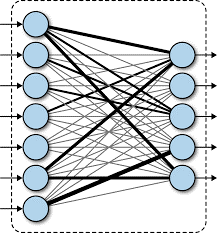
</p>

##### 4. Final Output Layer: 
After getting values from fully connected layer, well connect them to final layer of neurons [having count equal to total number of classes], that will predict the probability of each image to be in different classes.

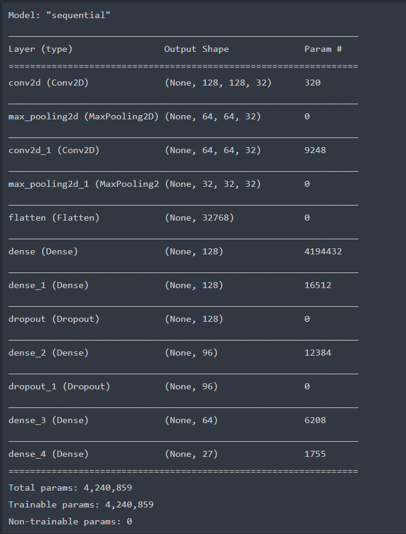


### 4: The final step after the model has been trained is of creating a GUI that will be used to convert Sings into text and form sentence, which would be helpful for communicating with D&M people.

##### Training:
I have converted our input images (RGB) into grayscale and applied gaussian blur to remove unnecessary noise. I then applied adaptive threshold to extract hand from the background and resize the images to 128 x 128.

I feed the input images after preprocessing to the model for training and testing after applying all the operations mentioned above.

The prediction layer estimates how likely the image will fall under one of the classes. So, the output is normalized between 0 and 1 and such that the sum of each value in each class sums to 1. I have achieved this using SoftMax function.

At first the output of the prediction layer will be somewhat far from the actual value. To make it better I have trained the networks using labeled data. The cross-entropy is a performance measurement used in the classification. It is a continuous function which is positive at values which is not same as labeled value and is zero exactly when it is equal to the labeled value. 

Therefore, I optimized the cross-entropy by minimizing it as close to zero. To do this in my network layer I adjusted the weights of my neural network. TensorFlow has an inbuilt function to calculate the cross entropy.

As I have out the cross-entropy function, then I optimized it using Gradient Descent in fact with the best gradient descent optimizer is called Adam Optimizer.

##### Testing:
While testing the applications I found out that some of the symbol predictions were coming out wrong.

So, I used two layers of algorithms to verify and predict symbols which are more similar to each other so that I can get close as I can to detect the symbol shown. 

In my testing the following symbols were not showing properly and were giving output as other symbols :

1.	For D : R and U
2.	For U : D and R
3.	For I : T, D, K and I
4.	For S : M and N

So, to handle above cases I made three different classifiers for classifying these sets:

1.	{D, R, U}
2.	{T, K, D, I}
3.	{S, M, N} 

The GUI(Graphical User Interface) of the application is as shown below :

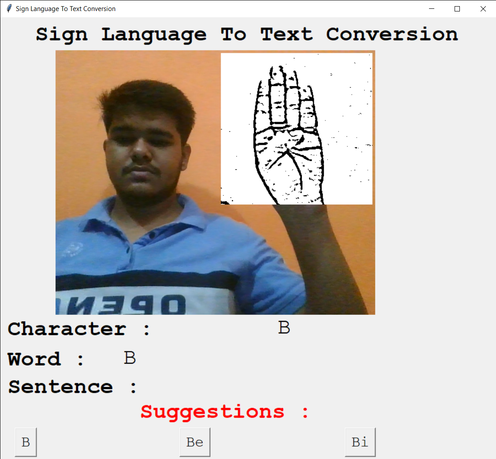

Flow Chart for Gesture Classification is as following :


Application Working Diagram is as following :

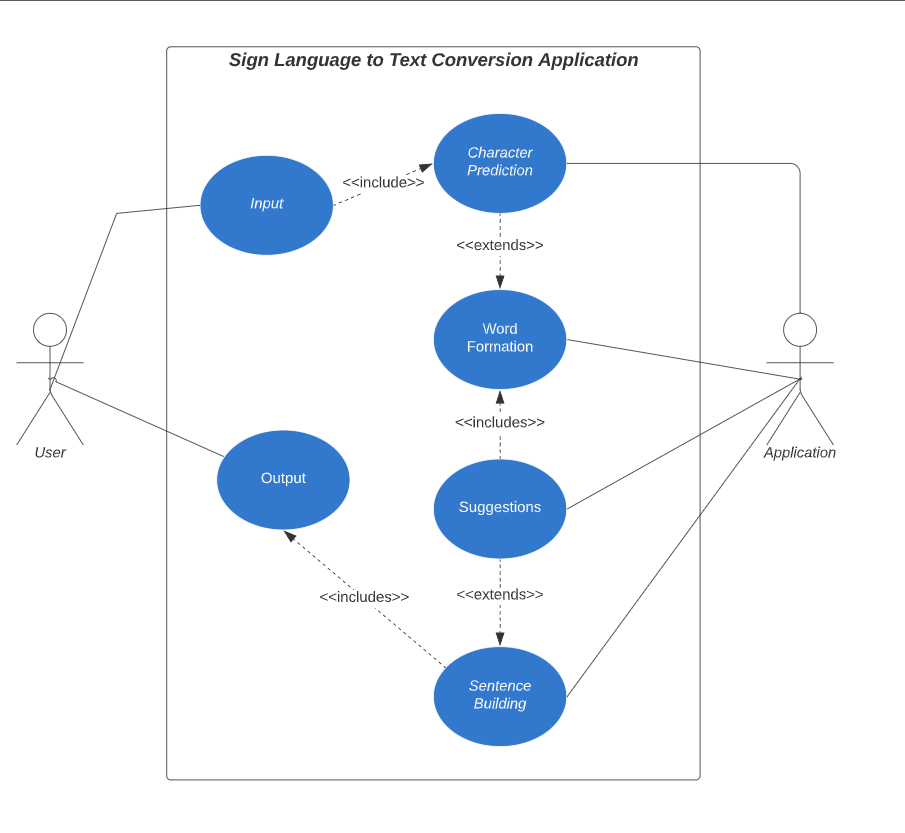

### 5. Results:
I have achieved an accuracy of 95.8% in my model using only layer 1 of the algorithm, and using the combination of layer 1 and layer 2 I achieve an accuracy of 98.0%.

Below are the confusion matrices for our results:

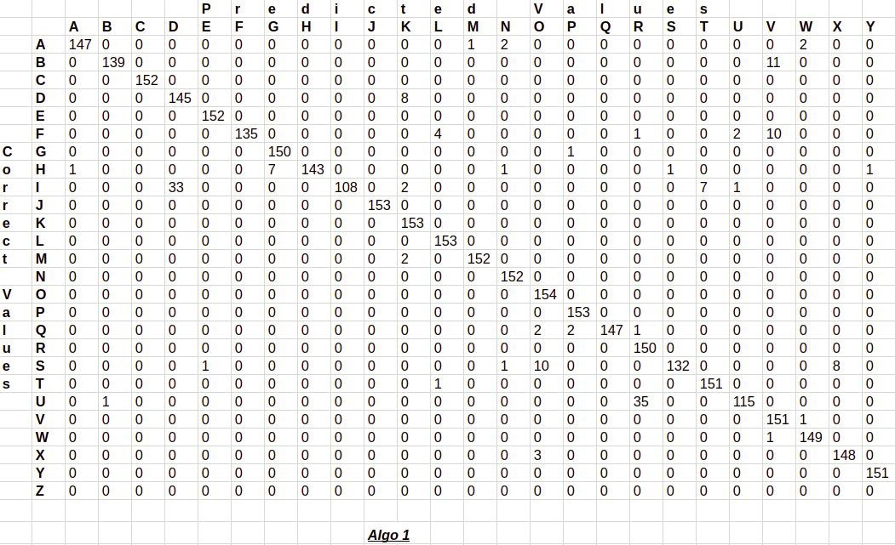
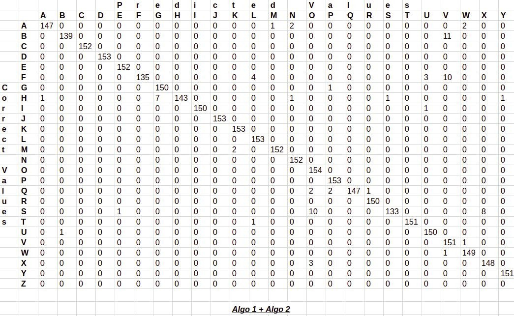


## Libraries Requirements -(Requires the latest pip version to install all the packages)

Note : Python 3.8 or above is required to build this project, as some of the libraries required can't be installed on the lastest version of the Python  

```bash
1. Lastest pip -> pip install --upgrade pip

2. numpy -> pip install numpy

3. string -> pip install strings

4. os-sys -> pip install os-sys

5. opencv -> pip install opencv-python

6. tensorFlow -> i) pip install tensorflow 
                 ii) pip3 install --upgrade https://storage.googleapis.com/tensorflow/linux/cpu/tensorflow-0.8.0-cp34-cp34m-linux_x86_64.whl

7. keras -> pip install keras

8. tkinter -> pip install tk

9. PIL -> pip install Pillow

10. enchant -> pip install pyenchant (Python bindings for the Enchant spellchecking system)

11. hunspell -> pip install cyhunspell (A wrapper on hunspell for use in Python)
```

## Running the Project 

``` python
python /path/to/the/Application.py
```
# License

Copyright (c) 2021 Nikhil Gupta

Permission is hereby granted, free of charge, to any person obtaining a copy
of this software and associated documentation files (the "Software"), to deal
in the Software without restriction, including without limitation the rights
to use, copy, modify, merge, publish, distribute, sublicense, and/or sell
copies of the Software, and to permit persons to whom the Software is
furnished to do so, subject to the following conditions:

The above copyright notice and this permission notice shall be included in all
copies or substantial portions of the Software.

THE SOFTWARE IS PROVIDED "AS IS", WITHOUT WARRANTY OF ANY KIND, EXPRESS OR
IMPLIED, INCLUDING BUT NOT LIMITED TO THE WARRANTIES OF MERCHANTABILITY,
FITNESS FOR A PARTICULAR PURPOSE AND NONINFRINGEMENT. IN NO EVENT SHALL THE
AUTHORS OR COPYRIGHT HOLDERS BE LIABLE FOR ANY CLAIM, DAMAGES OR OTHER
LIABILITY, WHETHER IN AN ACTION OF CONTRACT, TORT OR OTHERWISE, ARISING FROM,
OUT OF OR IN CONNECTION WITH THE SOFTWARE OR THE USE OR OTHER DEALINGS IN THE
SOFTWARE.

  
